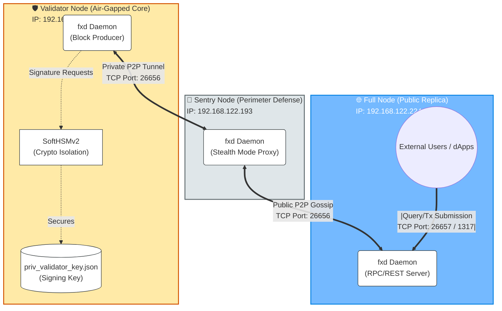

# Cosmos SDK v0.53: 3-Node Enterprise Cluster Deployment on RHEL 10

**Author:** Sugandha Amatya  
**Status:** Phases 1–3 Complete (Infrastructure, Binary Distribution, and Genesis Finalization)  
**Environment:** 3x Red Hat Enterprise Linux (RHEL) 10 VMs via KVM, managed via Ansible from a host ThinkPad.

---

## 🏗️ Architecture & Node Responsibilities

This lab simulates an enterprise-grade blockchain topology consisting of three distinct node types. 


* **Validator Node (`192.168.122.197`)**: The highly secured core of the network. It holds the cryptographic signing keys (`priv_validator_key.json`), proposes new blocks, and votes on consensus. It is isolated from the public internet.
* **Sentry Node**: The perimeter defense. It acts as a reverse proxy for the Validator, absorbing public peer-to-peer (P2P) traffic and forwarding valid transactions to the Validator via a private, hidden connection.
* **Full Node**: The public data replica. It synchronizes the entire blockchain ledger, serves RPC/REST queries to external applications, but does *not* participate in block creation or hold signing authority.

---

## 🚀 Deployment Phases & Ansible Mapping

### Phase 1: Infrastructure Initialization (`setup-nodes.yml`)
* **Target:** `hosts: cosmos` (All nodes)
* **High-Level Goal:** Provision VMs, register OS, and install core dependencies including hardware security modules.
* **Ansible Implementation:**
    * **OS Preparation:** Executed an automated "Nuclear Reset" via `ansible.builtin.shell` to unlock and register RHEL 10 subscription managers.
    * **Dependency Management:** Used `ansible.builtin.dnf` to install `gcc`, `make`, and `jq`.
    * **Environment Setup:** Configured Go v1.22/v1.23 and Rust repositories via `ansible.builtin.yum_repository`.
    * **HSM Integration:** Applied `when: "'validator' in group_names"` to isolate the installation of `SoftHSMv2` and Rust specifically to the Validator node, laying the groundwork for bank-grade secure key management.

### Phase 2: Application Layer Orchestration (`distribute-binary.yml`)
* **Target:** `hosts: cosmos` (All nodes)
* **High-Level Goal:** Compile the Cosmos SDK v0.53 binary (`fxd`) statically and distribute it to all nodes to initialize their data directories.
* **Ansible Implementation:**
    * **Compilation (Host):** Compiled from source on the ThinkPad with `CGO_ENABLED=0` to ensure GLIBC independence on RHEL 10.
    * **Binary Deployment:** Used `ansible.builtin.copy` to move the compiled `fxd` binary to `/usr/local/bin/` on the VMs.
    * **Node Initialization:** Executed `fxd init` via `ansible.builtin.command` to bootstrap the `~/.simapp` directory structures. This automatically generated the unique `priv_validator_key.json` and `node_key.json` files for each node.

### Phase 3: Security & Genesis - The "Air-Gapped" Workflow
Due to modern RHEL 10 kernel entropy management causing cryptographic generation hangs in KVM, key generation was strategically shifted to an "air-gapped" model using the host ThinkPad.

#### Part A: Key Injection (`inject-keys.yml`)
* **Target:** `hosts: validator`
* **Ansible Implementation:** * Iterated through locally generated test keys on the ThinkPad using `with_fileglob` (`~/cosmos_keys_clean/*`).
    * Securely pushed the unencrypted test keys (`admin.info`, `admin.address`) into the Validator's directory (`/home/sugandha/.simapp/keyring-test/`) via `ansible.builtin.copy`.

#### Part B: Genesis Finalization (`finalize-genesis.yml`)
* **Target:** `hosts: validator`
* **Ansible Implementation:**
    * **Gatekeeper Check:** Used `ansible.builtin.stat` to verify `admin.info` was present before proceeding.
    * **State Initialization:** Used `ansible.builtin.shell` to execute sequential `fxd` commands:
        1. `add-genesis-account`: Allocated 1,000,000,000 `stake` tokens to the `admin`.
        2. `gentx`: Cryptographically bound the `admin` funds to the Validator's staking power using the `priv_validator_key.json`.
        3. `collect-gentxs`: Merged the transactions to finalize the genesis file.
    * **Artifact Retrieval:** Used `ansible.builtin.fetch` to pull the finalized "Golden Source" `genesis.json` back to the ThinkPad for Phase 4 distribution.


---

## 🛠️ Ansible Configuration

### Inventory Configuration (`hosts.ini`)
```ini
[validator]
192.168.122.197 ansible_user=sugandha

[sentry]
192.168.122.X   ansible_user=sugandha  # IP of your Sentry VM

[fullnode]
192.168.122.Y   ansible_user=sugandha  # IP of your Full Node VM

[cosmos:children]
validator
sentry
fullnode
```

### Variable Matrix (`group_vars/all.yml`)
| Variable Name | Value | Purpose |
| :--- | :--- | :--- |
| `cosmos_user` | `sugandha` | Service account for all operations. |
| `cosmos_home` | `/home/sugandha/.simapp` | Base path for config, data, and keys. |
| `binary_path` | `/usr/local/bin/fxd` | Global path for the compiled SDK binary. |
| `chain_id` | `fx-local-1` | Unique cryptographic identifier for the chain. |

---

## 📂 Key Files Tracking

| File Name | Location | Confidentiality | Purpose |
| :--- | :--- | :--- | :--- |
| `fxd` | `/usr/local/bin/` (All Nodes) | Public | The compiled Cosmos SDK blockchain application binary. |
| `admin.info` | `~/.simapp/keyring-test/` (Validator) | Public* | Contains the public wallet address for the admin account. *(Note: Test backend used for lab).* |
| `priv_validator_key.json`| `~/.simapp/config/` (All Nodes) | **Strictly Private** | The cryptographic key that signs blocks. Never share the Validator's copy. |
| `genesis.json` | `ThinkPad: ./final_genesis.json` | Public | The "Golden Source" birth certificate of the network. Must be identical on all nodes to establish consensus. |

---

---

## 🚀 Phase 4: Network Distribution & Synchronization

With the "Golden Source" genesis file finalized on the ThinkPad, Phase 4 focuses on synchronizing the cluster state across the perimeter and replica nodes.

### Phase 4a: Genesis Distribution (`distribute-genesis.yml`)
* **Target:** `hosts: sentry, fullnode`
* **High-Level Goal:** Propagate the cryptographically signed `genesis.json` to all non-validating nodes to ensure the entire cluster shares the same starting block hash.
* **Ansible Implementation:**
    * **State Alignment:** Used `ansible.builtin.copy` to push the local `final_genesis.json` (from Phase 3b) to the remote `config/` directories of the Sentry and Full Node.
    * **Atomic Overwrite:** Applied `backup: yes` to preserve the original blank initialization files while enforcing the new global network state.
    * **Verification:** Performed directory-level validation to confirm the file permissions allow the `fxd` service to read the state on boot.


### 🖥️ Ansible Execution
To distribute the genesis state to the secondary nodes, run:

```bash
ansible-playbook -i hosts.ini distribute-genesis.yml -K
```

### Phase 4b: P2P Network Handshake (`configure-p2p.yml`)
* **Target:** `hosts: cosmos_nodes`
* **High-Level Goal:** Establish a secure hub-and-spoke P2P topology to isolate the Validator.
* **Discovery Step:** Before running the playbook, the unique cryptographic Node IDs must be retrieved from each node's `node_key.json`.
  
  **Command to retrieve Node IDs:**
  ```bash
  ansible cosmos_nodes -i hosts.ini -m shell -a "/usr/local/bin/fxd tendermint show-node-id --home /home/sugandha/.simapp" -u sugandha
  ```

Ansible Implementation: * Topology Enforcement: Modified config.toml to link the Validator and Full Node exclusively through the Sentry node.

        Stealth Configuration: Set private_peer_ids on the Sentry to ensure the Validator's metadata is never gossiped to the public network.

Execution:
```Bash

ansible-playbook -i hosts.ini configure-p2p.yml -K
```

## Not required
### Phase 4c: Port & API Gateway Configuration (`configure-ports.yml`)
* **Target:** `hosts: cosmos_nodes`
* **High-Level Goal:** Enforce the "Two Front Doors" architecture by opening application APIs exclusively on the Full Node, while strictly locking down the Validator and Sentry to P2P traffic only.
* **Ansible Implementation:**
    * **Full Node (API Gateway):** * Modified `config.toml` to bind the Tendermint RPC to `0.0.0.0:26657`, allowing external wallets to query the chain.
        * Modified `app.toml` under the `[api]` section to set `enable = true` and bind the REST server to `0.0.0.0:1317`.
    * **Validator & Sentry (Air-Gapped Core & P2P Firewall):** * Enforced strict `127.0.0.1:26657` bindings in `config.toml` to ensure they silently drop any external web requests.
    * **State Management:** Automatically restarted the `fxd` systemd services to apply the new network bindings.

**Execution:**
```bash
ansible-playbook -i hosts.ini configure-ports.yml -K
```

Port Mapping Summary:
| Node Type | P2P (26656) | RPC (26657) | REST API (1317) |
| :--- | :--- | :--- | :--- |
| Full Node | Open (0.0.0.0) | Open (0.0.0.0) | Open (0.0.0.0) |
| Sentry | Open (0.0.0.0) | Closed (127.0.0.1) | Closed |
| Validator | Open (Sentry only) | Closed (127.0.0.1) | Closed |

##N

### Phase 5: Daemonization (`start-network.yml`)
* **Target:** `hosts: cosmos_nodes`
* **High-Level Goal:** Wrap the `fxd` application in a standard Linux `systemd` service. This treats the blockchain node like an enterprise application, ensuring background execution, crash recovery, and centralized logging.
* **Ansible Implementation:**
    * **Service Creation:** Generated `/etc/systemd/system/fxd.service` to manage the daemon lifecycle.
    * **Resource Tuning:** Configured the `LimitNOFILE=4096` directive within the service unit. Because blockchain nodes constantly gossip blocks and transactions over P2P TCP connections, raising this limit prevents the node from crashing under the default Linux file descriptor limits.
    * **State Management:** Reloaded the system daemon and set the `fxd` service to `enabled` (start on boot) and `started`.

**Execution:**
```bash
ansible-playbook -i hosts.ini start-network.yml -K
```
***Check block height***
```bash
ansible validator -i hosts.ini -m command -a "journalctl -u fxd -n 50 --no-pager" -u sugandha
```





# Cosmos SDK v0.53: 3-Node Enterprise Cluster Deployment on RHEL 10

**Author:** Sugandha Amatya  
**Status:** Phases 1–5 Complete (Infrastructure, Binary, Genesis, P2P Networking, and Daemonization)  
**Environment:** 3x Red Hat Enterprise Linux (RHEL) 10 VMs via KVM, managed via Ansible from a host ThinkPad.

---

## 🏗️ Architecture & Node Responsibilities

This lab simulates an enterprise-grade blockchain topology consisting of three distinct node types. The architecture implements a "Sentry Node" design to protect the Validator from direct public internet exposure, while integrating hardware security module (HSM) concepts for key management.


